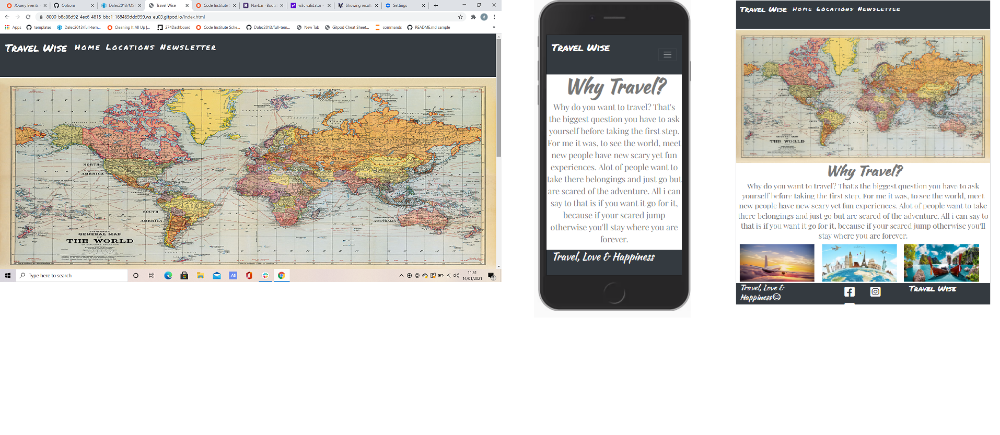
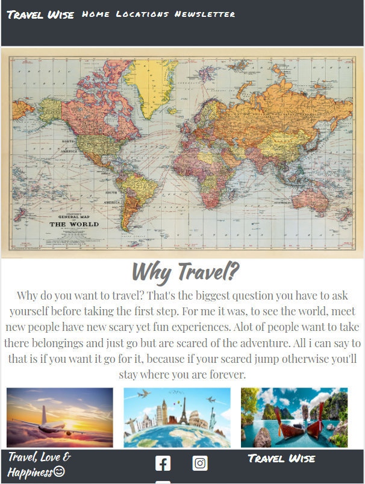
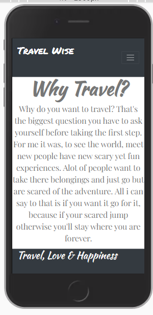
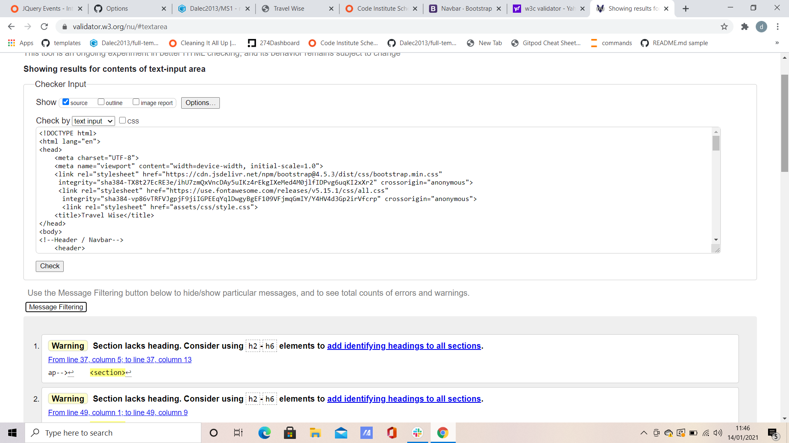
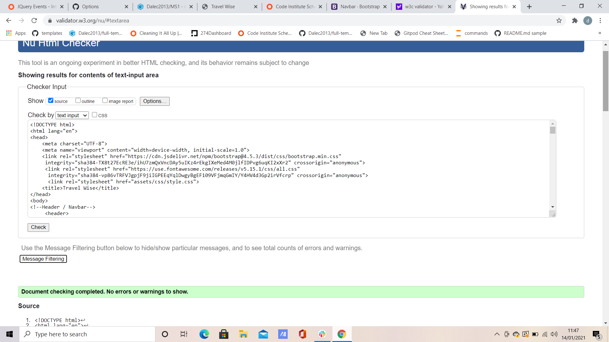
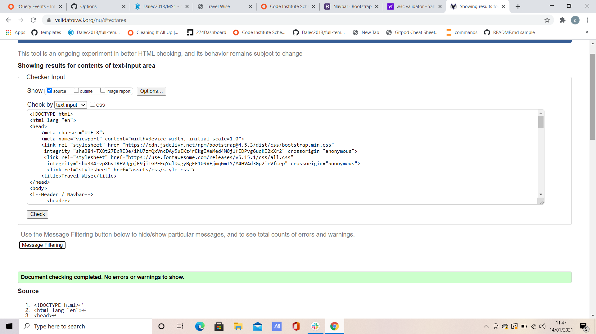
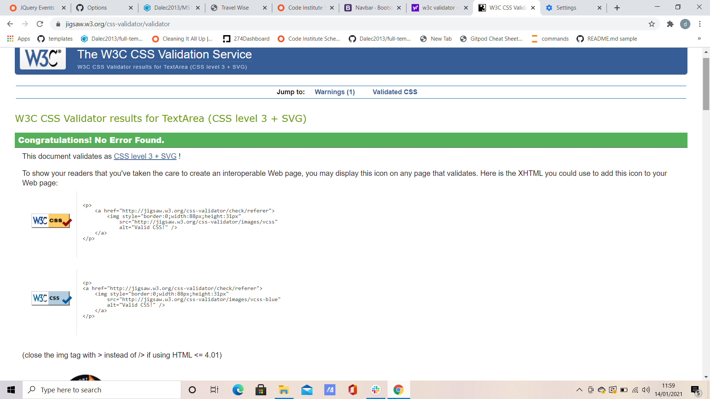

# Travel wise
Live page link. (https://dalec2013.github.io/MS1/)

This is a blog to give ideas on where to travel, from past experinces and research done online.
My site is responsive on all devices.
* Results.

## User Experince (UX)

* User stories
    * First time visitor goals.
        
        1. To find the site easy to navigate round, and read about amazing locations.
        2. As a first time visitor i'd like to find the site pleaseing to the eye and want to return.
    
    * Returning User goals
        1. To see the site has grown with more locations and more information.
        2. To sign up to a newsletter to stay informed of any new changes present.
    ----
## Design
    
* Colour scheme
    * The colour scheme is simple yet easy on the eyes, Black, Grey and white.
* Typography 
    * The Texturina font was used for the headings, while the Playfair Display font was used for the text.
        The Texturina font is bold with smooth edegs, and Playfair is a fine yet professional text.
* Imagery 
    * The imagery was a big part of this site, as people would want to see what the places they was reading about looked like.

### Wireframe

#### Features 
 The site is responsive on all devices.
 The navigation bar works on all devices.

 ## Technologies used
#### Languages used 
* HTML 
* CSS
#### Frameworks, Libarys and Programs Used
* Bootstrap 4.1 was used for the navbar and the framework of the site.
* GoogleFonts was used for my fonts (Texturina, Playfair Display)
* Fontawsome was used for my icons on all pages.
* git/gihub was used to code th site and push my code to the github to store my projects.
* balsmiq was used for my wireframes which are linked below.

## Testing
The w3c mark up validator and The w3c CSS validator was used to validate all pages of the site to make sure there was no syntax errors.
* html ,,.
* CSS 

### Testing user stories against user experience (UX)

* First time visitor goals. 
    * As a first time visitor, i want to find the site easy to navigate with relivent information, but not to be over cumbered with information.
        * when arriving on the site users are greeted with an easy to use navigation bar, a hero image and a small amout of text explaining what the site's about.
        * From the home page its very clear what the user is to experience through the site.
        * The user has the option's to head over to the locations and view some places and learn a little more about said places, or sign up to my newsletter.

* Returning visitor goals.
    * As a returning visitor , I will be intrested in learning a little bit more about the places I didn't read about on my firt time to the site.
    * When returning to the site I found the site easy to navigate and fresh with the choice to sign up to a newsletter, a good idea  to keep me upto date with any new travel advice.

* Frequent user goals.
    * As a frequent user i would expect the site to be updated with new locations and more information for me to read up on to get ideas for holiday ideas.
    * I have signed p to the newsletter and enjoy seeing new places and even  enjoy readin about some of the places iv already read about as im intersted in travel.

#### Further Testing
The site has been test on a variety of devices, such as desktop, Ipad pro, Iphone6/7/8/X after the problem i had with my button not working.
I decided to go with just a smaller navigation bar on mobile devices. I've tested the site on Google Chrome, Microsoft Edge and firefox.
All seems to work well with the minor exception that on an Ipad Pro the footer seeems to get a little bit misshaped with it dropping my qoute into two lines,
and moving one of my social links below the others.

#### Known Bugs
On some mobile devices my navigation isn't quite centered the text seems to be floating to the right.
On the Ipad Pro the footer is misshapped, with it dropping a social link below the others and putting my quote into two lines.

## Deployment 

### Github pages

The prject was deployed to git hub using these steps...

1. Login to github and locate the [MS1 repository](https://github.com/Dalec2013?tab=repositories).
2. At the top of the repository locate the settings tab.
3. Scroll down the page till you find the "GitHub Pages" section.
4. Under source cliick the dropdown box labeled none and select master branch.
5. The page will refresh.
6. Scroll back down the page to get to the published link (https://dalec2013.github.io/MS1/.)

## Images sourced From

* World Map: https://www.stanfords.co.uk/content/images/thumbs/022/0228916_coverimage_9786000531881.jpeg
* Plane: https://singularityhub.com/wp-content/uploads/2018/12/airplane-flying-above-clouds_shutterstock_553131187-1068x601.jpg
* Travel: https://ceblog.s3.amazonaws.com/wp-content/uploads/2012/05/20172622/ce-travel.jpg
* Beach: https://wwwnc.cdc.gov/travel/images/thailand.jpg
* Amsterdam: https://upload.wikimedia.org/wikipedia/commons/b/be/KeizersgrachtReguliersgrachtAmsterdam.jpg
* Rome: https://www.fodors.com/wp-content/uploads/2018/10/HERO_UltimateRome_Hero_shutterstock789412159.jpg
* New York: https://media.architecturaldigest.com/photos/5da74823d599ec0008227ea8/16:9/w_2560%2Cc_limit/GettyImages-946087016.jpg
* Bali: https://media.timeout.com/images/105240189/image.jpg
* Mexico: https://thumbor.forbes.com/thumbor/fit-in/1200x0/filters%3Aformat%28jpg%29/https%3A%2F%2Fspecials-images.forbesimg.com%2Fimageserve%2F1086671738%2F0x0.jpg%3FcropX1%3D0%26cropX2%3D3899%26cropY1%3D360%26cropY2%3D2554
* Barbados: https://cdn.britannica.com/89/94489-050-4920E18B/Palm-trees-ocean-Barbados.jpg
* Hand Heart: https://content.tripster.com/travelguide/wp-content/uploads/2014/05/Love-Beach-ThinkstockPhotos-480177829.jpg